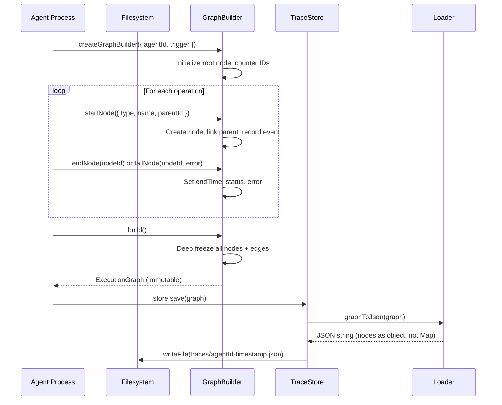
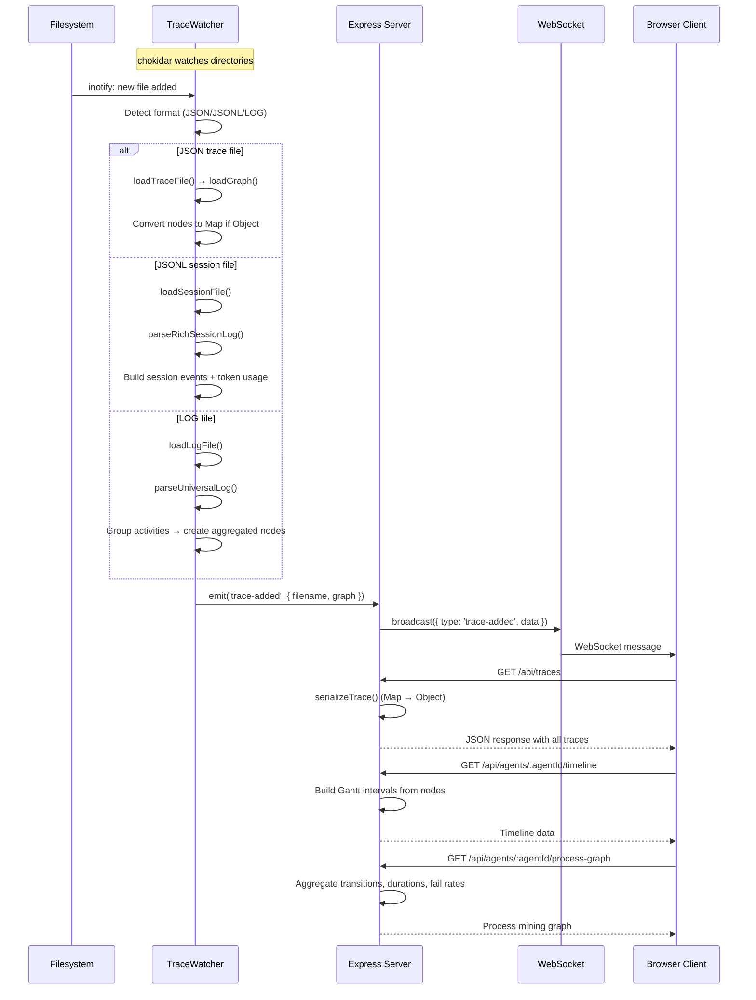
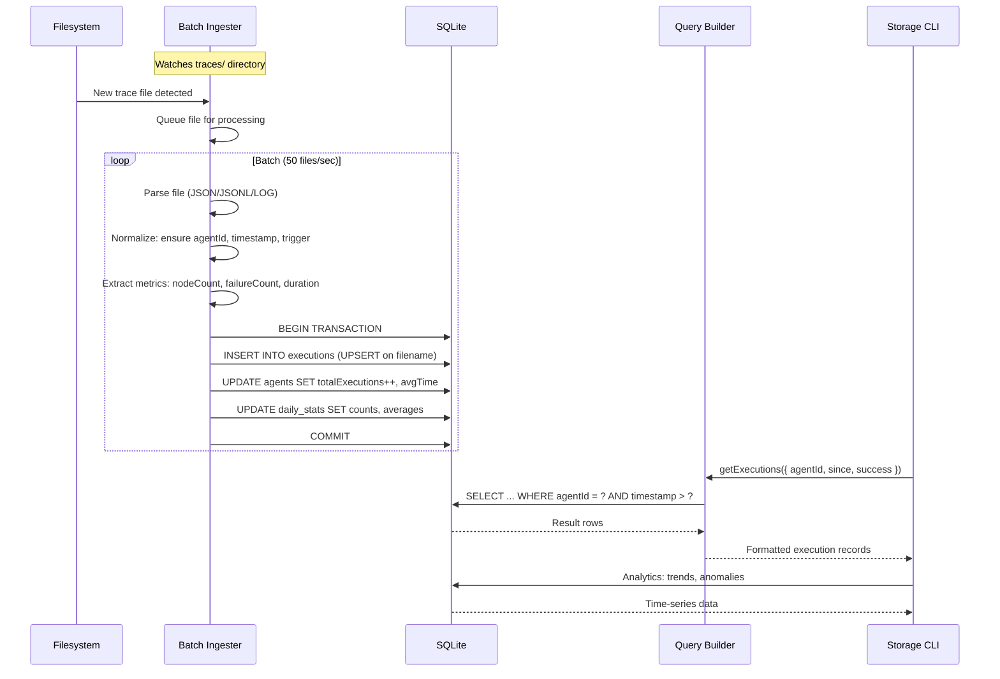
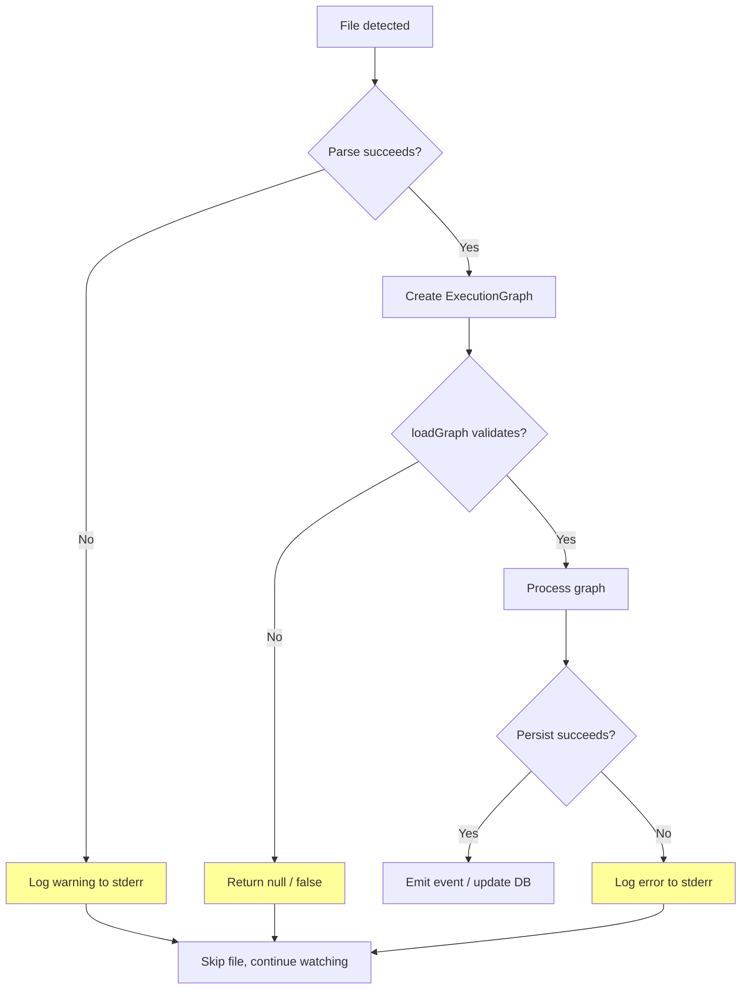

# Data Flow

## Critical Path 1: Agent Execution → Graph Construction → Persistence

## Critical Path 2: Trace File → Dashboard API → Browser

## Critical Path 3: Trace File → Storage Ingestion → Analytics Query

## Error & Retry Flows

**Current weakness:** All error paths log to stderr and silently continue. No retry mechanism, no dead-letter queue, no alerting on persistent parse failures.
