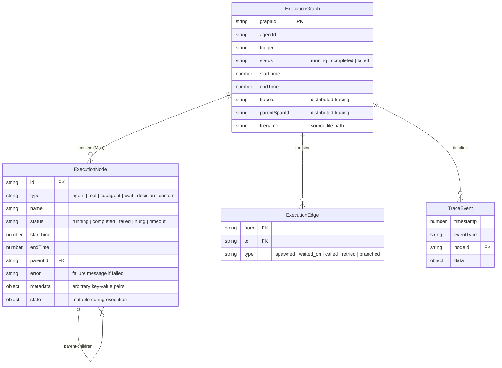
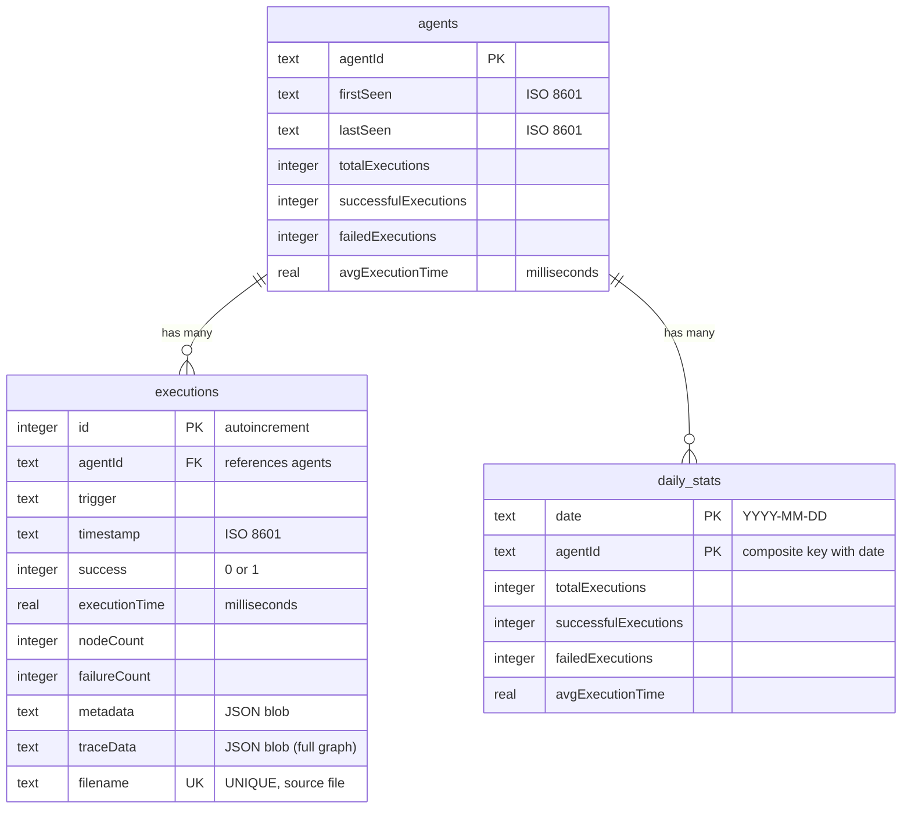
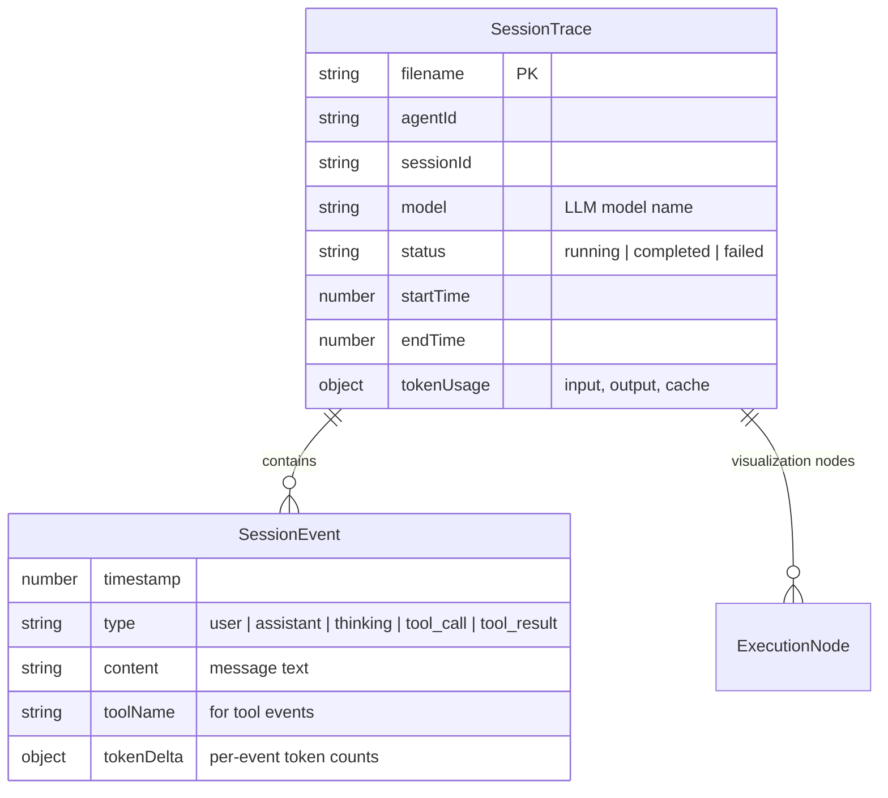
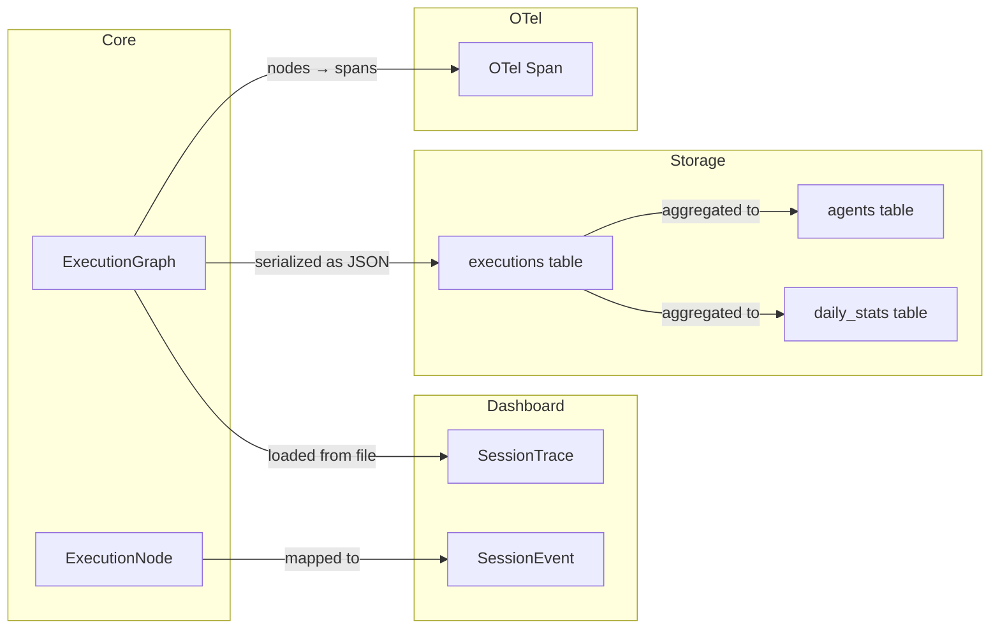

# Entity-Relationship Diagram

## Core Data Model (In-Memory)

```mermaid
erDiagram
    ExecutionGraph {
        string graphId PK
        string agentId
        string trigger
        string status "running | completed | failed"
        number startTime
        number endTime
        string traceId "distributed tracing"
        string parentSpanId "distributed tracing"
        string filename "source file path"
    }

    ExecutionNode {
        string id PK
        string type "agent | tool | subagent | wait | decision | custom"
        string name
        string status "running | completed | failed | hung | timeout"
        number startTime
        number endTime
        string parentId FK
        string error "failure message if failed"
        object metadata "arbitrary key-value pairs"
        object state "mutable during execution"
    }

    ExecutionEdge {
        string from FK
        string to FK
        string type "spawned | waited_on | called | retried | branched"
    }

    TraceEvent {
        number timestamp
        string eventType
        string nodeId FK
        object data
    }

    ExecutionGraph ||--o{ ExecutionNode : "contains (Map)"
    ExecutionGraph ||--o{ ExecutionEdge : "contains"
    ExecutionGraph ||--o{ TraceEvent : "timeline"
    ExecutionNode ||--o{ ExecutionNode : "parent-children"
```

## Storage Schema (SQLite)

```mermaid
erDiagram
    executions {
        integer id PK "autoincrement"
        text agentId FK "references agents"
        text trigger
        text timestamp "ISO 8601"
        integer success "0 or 1"
        real executionTime "milliseconds"
        integer nodeCount
        integer failureCount
        text metadata "JSON blob"
        text traceData "JSON blob (full graph)"
        text filename UK "UNIQUE, source file"
    }

    agents {
        text agentId PK
        text firstSeen "ISO 8601"
        text lastSeen "ISO 8601"
        integer totalExecutions
        integer successfulExecutions
        integer failedExecutions
        real avgExecutionTime "milliseconds"
    }

    daily_stats {
        text date PK "YYYY-MM-DD"
        text agentId PK "composite key with date"
        integer totalExecutions
        integer successfulExecutions
        integer failedExecutions
        real avgExecutionTime
    }

    agents ||--o{ executions : "has many"
    agents ||--o{ daily_stats : "has many"
```

## Dashboard Session Model (In-Memory)

```mermaid
erDiagram
    SessionTrace {
        string filename PK
        string agentId
        string sessionId
        string model "LLM model name"
        string status "running | completed | failed"
        number startTime
        number endTime
        object tokenUsage "input, output, cache"
    }

    SessionEvent {
        number timestamp
        string type "user | assistant | thinking | tool_call | tool_result"
        string content "message text"
        string toolName "for tool events"
        object tokenDelta "per-event token counts"
    }

    SessionTrace ||--o{ SessionEvent : "contains"
    SessionTrace ||--o{ ExecutionNode : "visualization nodes"
```

## Relationships Across Packages

```mermaid
graph LR
    subgraph Core
        EG[ExecutionGraph]
        EN[ExecutionNode]
    end

    subgraph Dashboard
        ST[SessionTrace]
        SE[SessionEvent]
    end

    subgraph Storage
        EX[executions table]
        AG[agents table]
        DS[daily_stats table]
    end

    subgraph OTel
        Span[OTel Span]
    end

    EG -->|serialized as JSON| EX
    EG -->|nodes → spans| Span
    EG -->|loaded from file| ST
    EN -->|mapped to| SE
    EX -->|aggregated to| AG
    EX -->|aggregated to| DS
```
