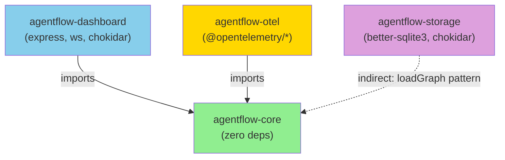
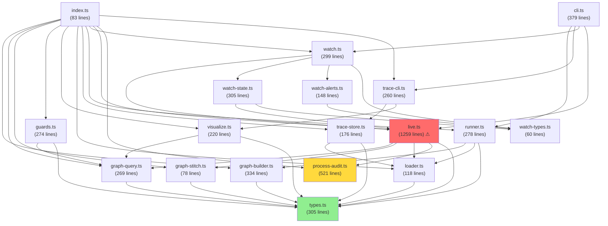
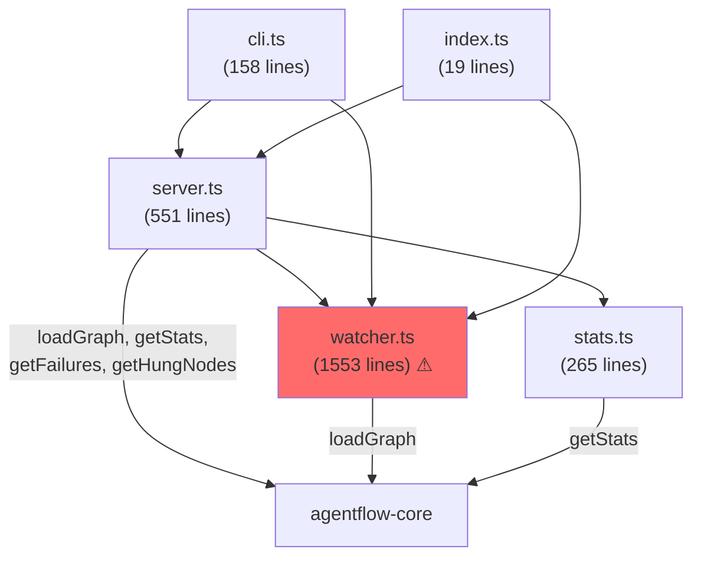
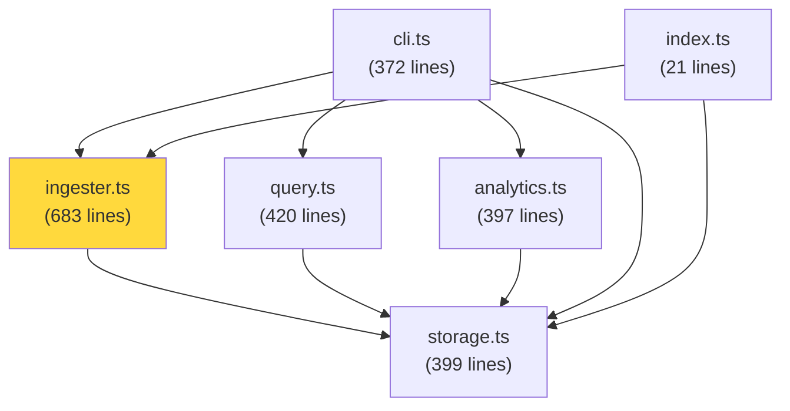

# Module Dependency Graph

## Package-Level Dependencies

## Core Module Dependencies (Internal)

## Dashboard Module Dependencies

## Storage Module Dependencies

## Circular Dependencies

**None detected.** The dependency graph is a clean DAG (directed acyclic graph) with `types.ts` as the leaf and CLI entry points as roots.

## Dependency Hotspots

| Module | Depended on by | Risk |
|--------|---------------|------|
| `types.ts` | 14 modules | Low (stable, interface-only) |
| `graph-query.ts` | 5 modules | Low (pure functions) |
| `live.ts` | 4 modules | **High** (god file, mutation-heavy) |
| `loader.ts` | 5 modules | Medium (no validation) |
| `watcher.ts` | 3 modules | **High** (god file) |
