# System Architecture

## High-Level Architecture

```mermaid
graph TB
  subgraph "Agent Systems (External)"
    Alfred["Alfred Orchestrator"]
    OpenClaw["OpenClaw Agents"]
    Custom["Custom Agents"]
  end

  subgraph "Filesystem (Shared Medium)"
    TraceFiles["JSON Trace Files"]
    SessionFiles["JSONL Session Logs"]
    LogFiles["LOG/TRACE Files"]
    WorkerState["workers.json / state files"]
  end

  subgraph "AgentFlow Core (zero deps)"
    GraphBuilder["Graph Builder<br/>createGraphBuilder()"]
    GraphQuery["Graph Query<br/>getStats, getFailures, getCriticalPath"]
    Guards["Runtime Guards<br/>checkGuards, withGuards"]
    Loader["Loader<br/>loadGraph, graphToJson"]
    Visualize["Visualizer<br/>toAsciiTree, toTimeline"]
    TraceStore["Trace Store<br/>JSON file persistence"]
    LiveDash["Live Terminal Dashboard<br/>ANSI real-time monitor"]
    ProcessAudit["Process Auditor<br/>PID, systemd, /proc"]
    WatchSystem["Watch + Alerts<br/>State transitions → Slack/webhook"]
  end

  subgraph "AgentFlow Dashboard (Express + WS)"
    Server["Express Server<br/>REST API + WebSocket"]
    Watcher["Trace Watcher<br/>chokidar file monitoring"]
    Stats["Stats Engine<br/>Per-agent analytics"]
  end

  subgraph "AgentFlow Storage (SQLite)"
    DB["better-sqlite3<br/>executions, agents, daily_stats"]
    Ingester["Batch Ingester<br/>File watcher → SQLite"]
    Query["Query Builder<br/>Filters, aggregation, export"]
    Analytics["Time-Series Analytics<br/>Trends, anomalies"]
  end

  subgraph "AgentFlow OTel"
    Exporter["OTel Exporter<br/>Graph → Spans"]
    OTelCollector["OTel Collector<br/>(Jaeger, Grafana, etc.)"]
  end

  %% Agent systems write to filesystem
  Alfred -->|writes| TraceFiles
  Alfred -->|writes| SessionFiles
  Alfred -->|writes| WorkerState
  OpenClaw -->|writes| LogFiles
  OpenClaw -->|writes| SessionFiles
  Custom -->|writes| TraceFiles

  %% Core reads from filesystem
  Loader -->|reads| TraceFiles
  LiveDash -->|scans| TraceFiles
  LiveDash -->|scans| SessionFiles
  LiveDash -->|scans| LogFiles
  LiveDash -->|scans| WorkerState
  ProcessAudit -->|reads| WorkerState

  %% Dashboard watches filesystem
  Watcher -->|watches| TraceFiles
  Watcher -->|watches| SessionFiles
  Watcher -->|watches| LogFiles
  Watcher -->|uses| Loader

  %% Dashboard uses core
  Server -->|queries| GraphQuery
  Server -->|uses| Stats
  Stats -->|uses| GraphQuery
  Watcher -->|emits events| Server

  %% Storage watches filesystem
  Ingester -->|watches| TraceFiles
  Ingester -->|watches| SessionFiles
  Ingester -->|persists| DB
  Query -->|reads| DB
  Analytics -->|reads| DB

  %% OTel export
  Exporter -->|converts| GraphBuilder
  Exporter -->|sends spans| OTelCollector

  %% Watch system
  WatchSystem -->|monitors| LiveDash
  WatchSystem -.->|alerts| Slack["Slack/Webhook"]

  %% Core internal
  GraphBuilder -->|produces| GraphQuery
  Guards -->|wraps| GraphBuilder
  TraceStore -->|uses| Loader
```

## Deployment Boundaries

Everything runs on a single machine. There are no network services except:
- **Dashboard server**: HTTP on localhost (default port 3000)
- **OTel exporter**: Sends spans to configured OTel collector endpoint

## Communication Patterns

| From | To | Pattern |
|------|-----|---------|
| Agent systems → Filesystem | File write | Async, append-only |
| Core/Dashboard → Filesystem | File read/watch | chokidar inotify + polling |
| Dashboard server → Browser | HTTP + WebSocket | Sync REST + async push |
| OTel exporter → Collector | OTLP HTTP/gRPC | Async batch export |
| Watch system → Slack | HTTP POST | Async webhook |
| Storage → SQLite | Synchronous | better-sqlite3 blocking calls |
