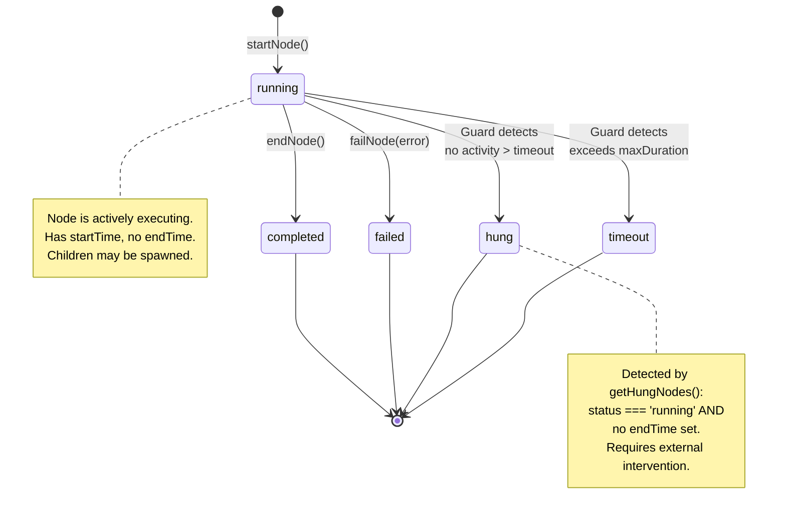
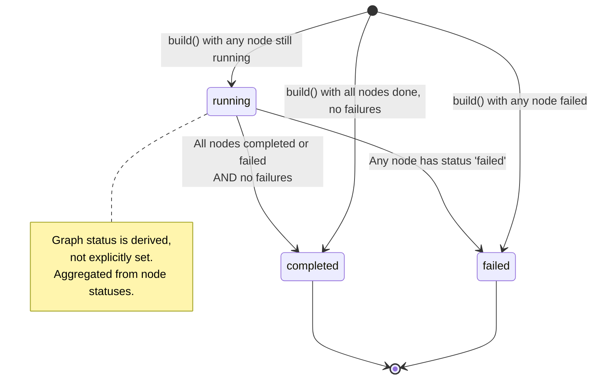
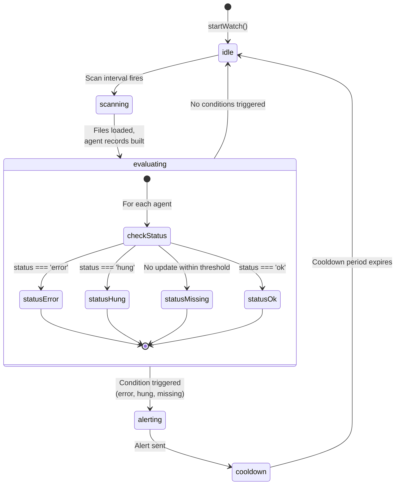
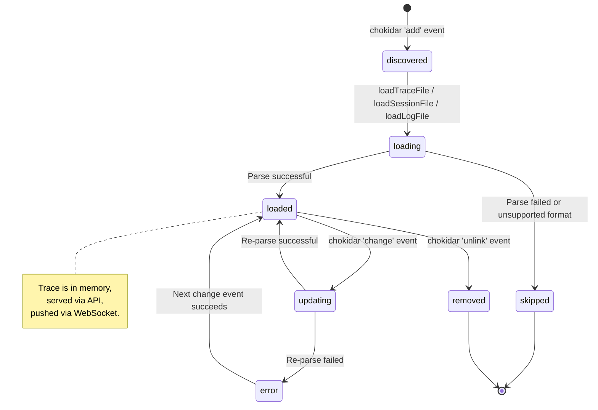
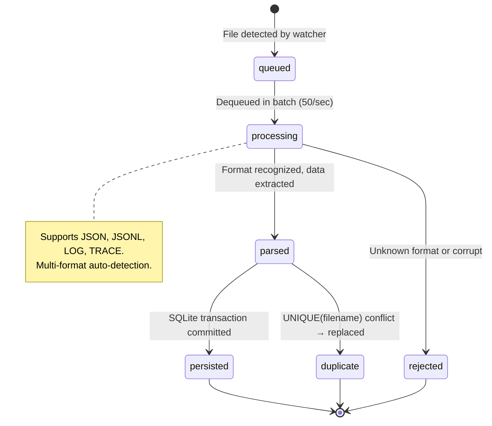

# System State Diagrams

## ExecutionNode State Machine

## ExecutionGraph Status Derivation

## Watch System State Machine

## Dashboard Watcher File States

## Storage Ingestion Pipeline States

